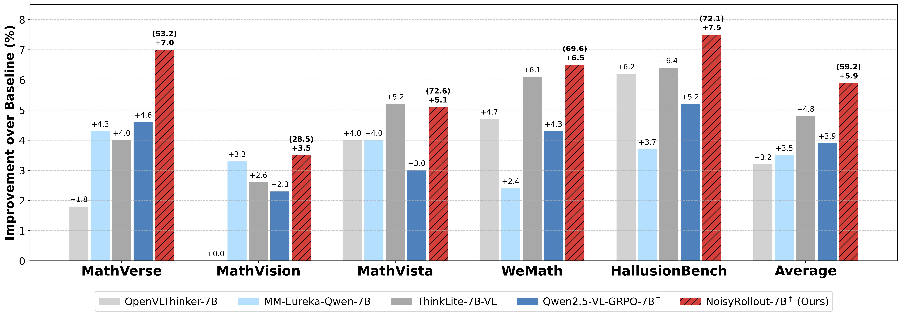
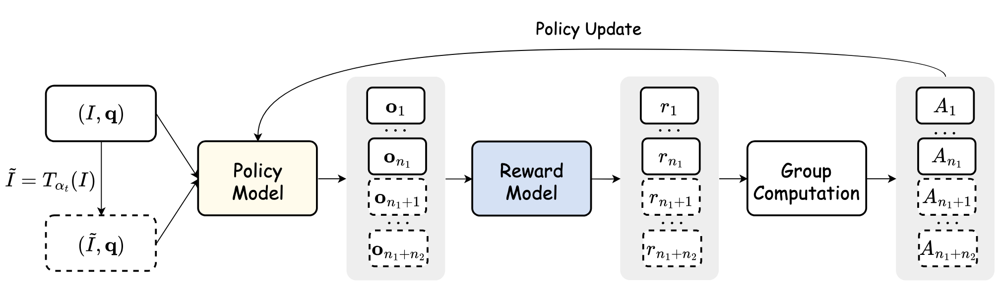

<div align="center">

# NoisyRollout: Reinforcing Visual Reasoning with Data Augmentation
[](https://arxiv.org/pdf/2504.13055) [](https://huggingface.co/collections/xyliu6/noisyrollout-67ff992d1cf251087fe021a2)

</div>

## ⚡ Updates

* 18/04/2025: 🎉 We release our paper, models and codebase.

## 🚀 TL;DR
<p align="center">
  
</p>

**NoisyRollout** is a simple and effective data augmentation strategy for the RL training of VLMs that improves visual reasoning through better policy exploration. It introduces *targeted rollout diversity* by mixing rollouts from both clean and moderately distorted images, encouraging the model to learn more robust behaviors. Moreover, a *noise annealing schedule* is implemented to ensure early-stage exploration and late-stage training stability.

🎯 **Key Benefits**:
- **No additional cost** — only the rollout strategy is modified 
- **Easy to adopt** — no changes to the model architecture or RL objective required  
- **Superior generalization** — achieves state-of-the-art results on **5** out-of-domain benchmarks (e.g., **MathVerse: 53.2%**, **HallusionBench: 72.1%**) with just **2.1K** RL samples

🫱 No complicated changes — just smarter rollouts and better training!

<p align="center">
  
</p>

## 🛠️ Usage
### (Step1) Install
```bash
conda create -n noisyrollout python=3.11 -y && conda activate noisyrollout

pip3 install torch==2.5.1 torchvision==0.20.1 torchaudio==2.5.1 transformers==4.49.0 numpy==1.26.4
pip3 install google-generativeai

# Use this version of vLLM to avoid memory leaks.
pip3 install --no-cache-dir vllm --pre --extra-index-url "https://wheels.vllm.ai/227578480d71fc94ef46ca77fb69496412158d68"
git clone -b verl_v1 https://github.com/hiyouga/vllm.git
cp -r vllm/vllm/ ~/miniconda3/envs/noisyrollout/lib/python3.11/site-packages/

pip3 install -e .
```
> 🚧 The vllm wheel seems to be broken now, you can download this wheel from this [link](https://drive.google.com/file/d/1tO6BQ4omkeXTQhDBTAFi7U7qR8vF55wP/view?usp=sharing).

### (Step 2) Training
```bash
# Geo3K (NoisyRollout)
bash training_scripts/qwen2_5_vl_7b_geo3k_noisyrollout.sh
# Geo3K (Vanilla GRPO)
bash training_scripts/qwen2_5_vl_7b_geo3k_grpo.sh

# K12 (NoisyRollout)
bash training_scripts/qwen2_5_vl_7b_k12_noisyrollout.sh
# K12 (Vanilla GRPO)
bash training_scripts/qwen2_5_vl_7b_k12_grpo.sh
```
### (Step 3) Evaluation
Before running the evaluation, please download the evaluation datasets from [🤗 NoisyRollout Evaluation](https://huggingface.co/datasets/xyliu6/noisyrollout_evaluation_data). Then, create a directory by running `mkdir -p ~/NoisyRollout/eval/data`, upload the `eval_data.zip` file to the `data` folder, and unzip it there.
```diff
#!/bin/bash
source ~/.bashrc
source ~/miniconda3/bin/activate noisyrollout

export VLLM_ATTENTION_BACKEND=XFORMERS
export VLLM_USE_V1=0
export GOOGLE_API_KEY="xxx" # put your api key here

HF_MODEL_PATH="xyliu6/NoisyRollout-Geo3K-7B"
RESULTS_DIR="results/"
EVAL_DIR="~/NoisyRollout/eval"
DATA_DIR="~/NoisyRollout/eval/data"

SYSTEM_PROMPT="""You FIRST think about the reasoning process as an internal monologue and then provide the final answer. The reasoning process MUST BE enclosed within <think> </think> tags. The final answer MUST BE put in \boxed{}."""

cd $EVAL_DIR
python main.py \
  --model $HF_MODEL_PATH \
  --output-dir $RESULTS_DIR \
  --data-path $DATA_DIR \
  --datasets geo3k,hallubench,mathvista,wemath,mathverse,mathvision \
  --tensor-parallel-size 2 \
  --system-prompt="$SYSTEM_PROMPT" \
  --min-pixels 262144 \
  --max-pixels 1000000 \
  --max-model-len 8192 \
  --temperature 0.0 \
  --eval-threads 24
```
> 🚧 Currently, only `Gemini-2.0-Flash-001` is supported for parsing generated responses. Support for additional models will be introduced in future updates.

## Citation
If you find our works useful for your research, please consider citing:
```bibtex
@misc{liu2025noisyrollout,
      title={NoisyRollout: Reinforcing Visual Reasoning with Data Augmentation}, 
      author={Xiangyan Liu and Jinjie Ni and Zijian Wu and Chao Du and Longxu Dou and Haonan Wang and Tianyu Pang and Michael Qizhe Shieh},
      year={2025},
      eprint={2504.13055},
      archivePrefix={arXiv},
      primaryClass={cs.CV},
      url={https://arxiv.org/abs/2504.13055}, 
}
```

## Acknowledgement
* This work is supported by [Sea AI Lab](https://sail.sea.com/) for computing resources.
* The training codes are built on [EasyR1](https://github.com/hiyouga/EasyR1), and the evaluation suite employs [vLLM](https://github.com/vllm-project/vllm) for acceleration.
* The base model is from [Qwen2.5-VL-7B-Instruct](https://huggingface.co/Qwen/Qwen2.5-VL-7B-Instruct).
* The original training datasets are from [Geometry3K](https://huggingface.co/datasets/hiyouga/geometry3k) and [K12](https://huggingface.co/datasets/FanqingM/MM-Eureka-Dataset).
* The evaluation datasets are from [MathVerse](https://huggingface.co/datasets/AI4Math/MathVerse), [MathVision](https://huggingface.co/datasets/MathLLMs/MathVision), [MathVista](https://huggingface.co/datasets/AI4Math/MathVista), [WeMath](https://huggingface.co/datasets/We-Math/We-Math), and [HallusionBench](https://github.com/tianyi-lab/HallusionBench).
