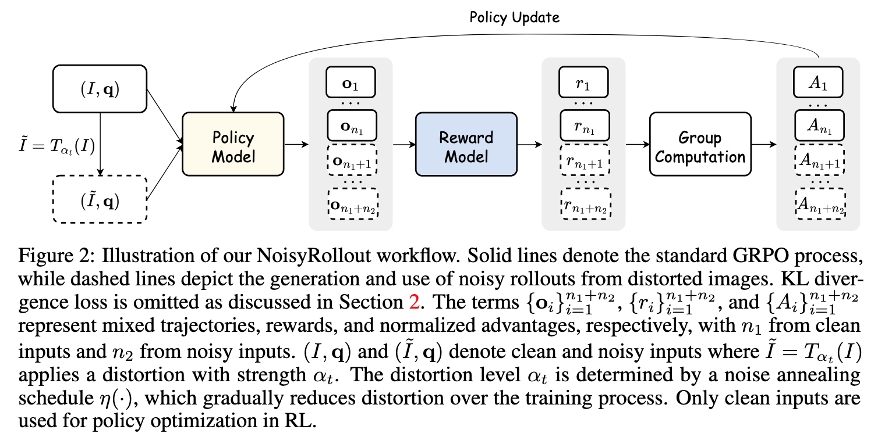

  

* In our current implementation of NoisyRollout, $n_1$ and $n_2$ are set to the same value. If you set `worker.rollout.n` to 6 in our NoisyRollout training scripts, it means $n_1=n_2=6$, resulting in a total of 12 rollouts.
* We empirically freeze the vision encoder and remove the KL loss for better performance.
* For `worker.actor.aug_type`, please only use `gaussian` for now, as the performance of other choices is not guaranteed.
* For `worker.actor.gaussian_noise_step` (i.e., initial noise strength $\alpha_0$ in our paper), it's a critical hyper-parameter when applying NoisyRollout to other datasets. Suggested values include 400, 450, and 500.
* We also suggest setting `worker.actor.decay_mode=sigmoid` with an appropriate `worker.actor.decay_decay_sig_mid_step` for stable training.